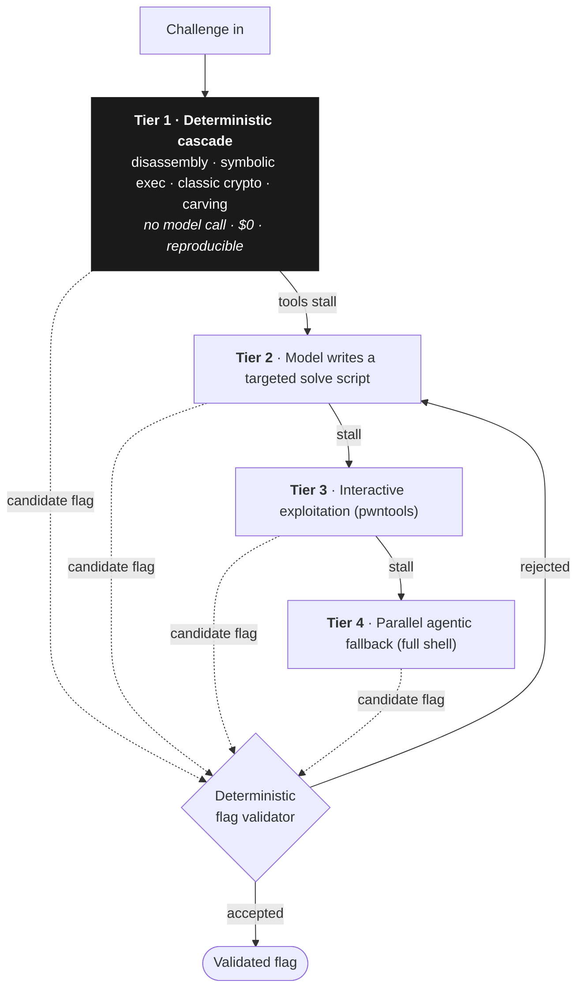
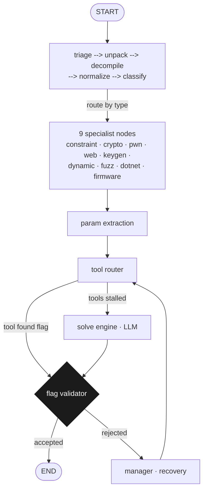

# KRAKEN

**An autonomous CTF auto-solver that reasons, runs tools, and captures flags with no human in the loop, on a local model or frontier cloud.**

KRAKEN reads a challenge, plans an approach, drives a battery of reverse-engineering, crypto,
pwn, forensics, and web tooling, writes and executes its own solve scripts, and validates the
flag it recovers, end to end, autonomously. It is a **model-agnostic harness**: it can run
fully offline on **local models via [Ollama](https://ollama.com)** at **$0**, and in practice
drives frontier models when a challenge needs deeper reasoning.

Its guiding principle: **tools produce artifacts that language models reason about.** Most of a
CTF is computation, disassembling a binary, brute-forcing a weak cipher, walking a constraint
system through a solver. KRAKEN does that with deterministic tooling and *no model call at all*,
and reaches for a model only when the tools run out. That deterministic tier is fast, free, and
byte-for-byte reproducible.



Each challenge descends this cheapest-first **cascade** and stops at the first tier that produces
a flag the deterministic validator accepts, so most challenges never reach a paid model call.

## The flag that said it couldn't be done

At **KalmarCTF 2026**, one reverse-engineering challenge (`flag_checker`, an iCE40 HX8K FPGA
bitstream) hid its flag inside the hardware. The flag was not the usual jumble of underscores; it
was a full English sentence, and the sentence was the challenge author's own bet, written into the
answer, that this simple reverse-engineering challenge could not be solved by an AI.

KRAKEN read it out anyway. Running on a **frontier model** driving its agentic tier, it converted
the FPGA bitstream to Verilog, built a simulation testbench, and brute-forced the flag **character
by character through 92 positions of FPGA simulation**, fully autonomously, with no human writing
the exploit. The author bet an AI couldn't do it, and wrote that bet into the flag. The AI recovered
the bet, one character at a time.

That is the kind of proof we care about more than a benchmark score, a real challenge, in a
real competition designed to defeat LLM solvers, whose own author didn't think this was possible.

**KRAKEN has autonomously solved hundreds of CTF challenges** across live competitions,
historical challenges, and public benchmarks, including:

- **BYU EOS CTF 2026**, cleared every online-solvable challenge (39 of 42) fully autonomously,
  end to end: pulled from CTFd, triaged, solved in parallel, and auto-submitted, in about ten
  minutes. This was done entirely remotely; three challenges required in-person access, and I
  asked to be removed from the leaderboard, so it was a top finish in spirit rather than an
  official placement.
- **26th of 275 at KalmarCTF 2026** (an anti-AI event), a ring-0 kernel ROP chain in 30 minutes,
  neural-network weight recovery by gradient peeling in 40, a real CVE found and exploited in
  CTFd, and the `flag_checker` FPGA solve above.

KRAKEN runs two ways, and it is worth being precise about which does what. A **$0 local model**
carries the fast, reproducible, static work: the deterministic cascade that resolves most benchmark
challenges with no paid model call. The marquee results above (the `flag_checker` solve, the BYU
sweep, the KalmarCTF placement) ran on a **frontier cloud model** driving the agentic tiers. That is
the honest division of labor. The offline cascade makes the static bulk free and repeatable; a
frontier model is what wins the hard, competition-grade challenges. Neither the "$0" nor the
"offline" framing should be read as how the top results were won. They were won with frontier models,
on top of a harness that keeps the cheap work cheap. The full technical report (design, results,
lineage, and an honest account of where the deterministic cascade is strong on static challenges and
weak on dynamic, interactive ones) is in
[`paper/project_kraken-v0.2.5.pdf`](paper/project_kraken-v0.2.5.pdf).

## How it works

KRAKEN is a **LangGraph** state machine of ~20 nodes over a `KrakenState` of ~48 fields. A
challenge flows through triage and classification, routes to one of nine per-category specialists,
runs the deterministic tool cascade, and terminates only when a non-model validator accepts a flag,
or a strategic manager decides to try another approach.



Around that core sit **100+ analysis helpers** (85 wired into the router), per-category specialist
agents, a deterministic flag validator, crash-resilient node wrappers, and a self-tuning cascade
optimizer. Two design rules do the heavy lifting:

- **Deterministic-first.** The top tier tries to find the flag with computation and no model call.
  21 of 23 CTFTiny challenges resolve this way, fast, free, and reproducible.
- **The validator is the oracle.** The model may *propose* a flag; only the deterministic
  validator can *confirm* one. On rejection the run retries a different way rather than declaring
  victory, which is what keeps an autonomous solver from confidently reporting non-flags.

See [`docs/TECHNICAL.md`](docs/TECHNICAL.md) for the full architecture (graph topology, state
machine, component model, and the tool cascade), and [`docs/RUNTIME_GUIDE.md`](docs/RUNTIME_GUIDE.md)
for running it fully offline.

## How KRAKEN was built

KRAKEN began as a from-scratch reimplementation of **[Squid Agent](https://spl.team/blog/squid-agent-csaw/)**
(SPL Team), a multi-agent CTF solver, which itself built on CSAW's **D-CIPHER** planner/executor
system. From that line we kept the one idea that mattered most: **per-category specialist agents**,
the way a real CTF team assigns a reverser, a pwner, a crypto person.

We diverged on two axes from the first commit. First, the **deterministic cascade**, most
published CTF agents put a model in the loop at *every* step, which is flexible but slow,
non-deterministic, and expensive; KRAKEN inverts that and reaches for the model last. Second, a
**model-agnostic harness** where the deterministic tooling and routing, not any one model, carry
the solve, so the same system runs offline on a local model at $0 or on a frontier model, and
challenge material can stay on the machine.

The engineering that turned this from a demo into something that runs overnight is the
unglamorous part: every graph node is wrapped for **crash-resilience** (an unhandled tool
exception reroutes to recovery instead of killing the run; eight cumulative crashes hard-brake to
a clean stop) and **idempotent caching** (a node never re-runs expensive work like Ghidra
decompilation if its result already exists in state). A closed-loop **optimizer** watches every
solve and re-orders the cascade so winning tools run first. The result is a system that can fan
dozens of tools across dozens of challenges in parallel without a single failure aborting the
batch, exactly what cleared the online-solvable set at a live CTF in about ten minutes of wall-clock.

The honest boundary, learned the hard way: this design dominates *static* challenges and is weak
on *dynamic, interactive* ones (live instances, network protocols, multi-step chains). The
[technical report](paper/project_kraken-v0.2.5.pdf) documents both sides.

## Install

Requires Python 3.11+ and [Ollama](https://ollama.com) (for local models).

```bash
git clone https://github.com/JKSNS/project_kraken.git
cd project_kraken
python3 -m venv .venv && source .venv/bin/activate
pip install -e .

# pull a solver model (any capable coding model works; this is the default tier)
ollama pull gpt-oss-20b-131k:latest
```

Optional extras: `pip install -e ".[angr,qr,gui,all]"`. External CLI tools (`ghidra`, `radare2`,
`binwalk`, ...) are auto-detected when present; KRAKEN degrades gracefully when they aren't.

## Quickstart

```bash
# solve a single challenge directory
kraken solve ./challenges/my_chal --flag-format "flag{}"

# solve every challenge in a directory, in parallel
kraken solve-all ./challenges/ --flag-format "CTF{}" -j 8

# fastest wall-clock: hybrid solver auto-routes cascade vs. agent per challenge
python3 scripts/hybrid_solve.py ./challenges/ --flag-format "CTF{}" -j 8

# pull + auto-solve a live CTFd instance
kraken ctf https://ctf.example.com --token <ctfd_token>

# list local models and how KRAKEN tiers them
kraken-runtime models
```

Every run drops artifacts (solve script, reasoning log, `session.json` with timing, and the
recovered flag) alongside the challenge files.

## Use it from Claude Code (MCP)

KRAKEN also exposes its tooling as an MCP server, so an agent can drive triage / decompile / solve
as native tools:

```bash
kraken-mcp        # starts the MCP server (stdio)
```

The `.claude/commands/` directory ships ready-made slash-commands (`/solve`, `/decompile`,
`/triage`, ...) for driving KRAKEN from Claude Code.

## Repository layout

```
src/kraken/        the solver. Spine at top level (orchestrator, graph, state,
                   models, schemas, config, mcp_server); subpackages for nodes/,
                   tools/, helpers/ (auto_*.py analysis library), runtime/,
                   storage/, execution/, platform/, knowledge/, ad/, gui/.
                   See src/kraken/README.md for the full map.
scripts/           hybrid_solve, flag submission, and scripts/ghidra/ headless
                   Ghidra helpers (decompile-all, call-graph, function dump)
docs/              TECHNICAL.md (architecture), RUNTIME_GUIDE.md (offline),
                   PITFALLS.md (pwn cheat-sheet)
paper/             the technical report (kraken_whitepaper.tex)
tests/             pytest suite (unit, integration, e2e)
```

## Lineage & acknowledgements

Full credit to the **SPL Team** (Squid Agent) and the **D-CIPHER** authors for the foundational
ideas, per-category specialist agents modeled on how a real CTF team assigns experts. KRAKEN's
divergence is the deterministic-first cascade and fully local, $0 operation. See the
[technical report](paper/project_kraken-v0.2.5.pdf) for the full related-work discussion.

## License

Creative Commons Attribution-NonCommercial 4.0 International (CC BY-NC 4.0).
Free to use, share, and build on with attribution; not for commercial use. See
[LICENSE](LICENSE).
