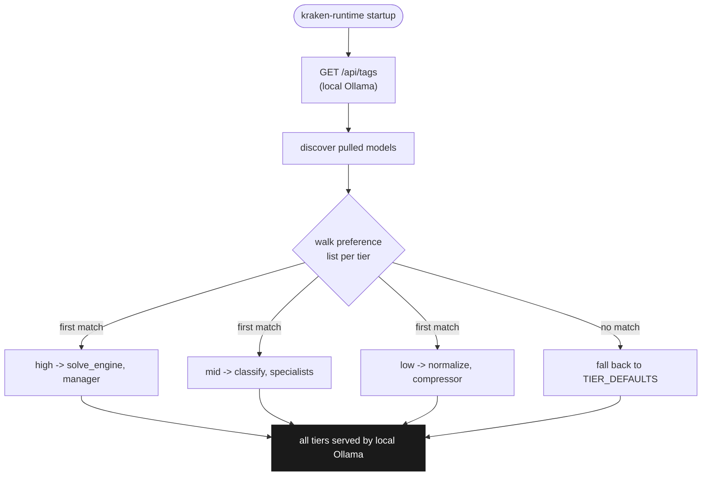

# KRAKEN Runtime Guide: Offline Agentic CTF Solver

KRAKEN Runtime is the fully offline, self-contained execution mode for KRAKEN. It replaces cloud-dependent LLM backends with locally-hosted Ollama models, adds intelligent model routing across GPU tiers, session persistence for pause/resume workflows, per-call metrics collection, adaptive context management, and a dedicated CLI (`kraken-runtime`). Everything runs on your hardware with zero external API calls.

This guide covers setup, configuration, GPU-aware model selection, session management, benchmarking, and troubleshooting.

---

## Table of Contents

1. [Quick Start](#1-quick-start)
2. [Model Recommendations per GPU Tier](#2-model-recommendations-per-gpu-tier)
3. [Tiered Model Routing](#3-tiered-model-routing)
4. [Session Management](#4-session-management)
5. [Metrics and Telemetry](#5-metrics-and-telemetry)
6. [Batch Solving](#6-batch-solving)
7. [Troubleshooting](#7-troubleshooting)
8. [Comparison with Other Modes](#8-comparison-with-other-modes)

---

## 1. Quick Start

### Prerequisites

- Python 3.11+
- [Ollama](https://ollama.com) installed and running
- At least one model pulled (see [Model Recommendations](#2-model-recommendations-per-gpu-tier))
- Ghidra (optional but recommended for decompilation quality)
- 8 GB+ VRAM recommended (CPU-only inference is functional but slow)

### Install KRAKEN

```bash
git clone https://github.com/JKSNS/project_kraken.git
cd project_kraken
python3 -m venv venv
source venv/bin/activate
pip install -e .

# Optional but recommended
bash setup.sh          # installs Ghidra, system tools, writes .env
source .env            # load Ghidra/Java paths
```

### Pull Models

Pull at least one model before running. For a single-GPU setup with 8 GB VRAM:

```bash
ollama pull glm-4.7-flash
```

For a 16 GB+ setup with tiered routing:

```bash
ollama pull devstral-small-2:24b
ollama pull glm-4.7-flash
```

For a 24 GB+ setup with full tier coverage:

```bash
ollama pull qwen3-coder:30b
ollama pull devstral-small-2:24b
ollama pull glm-4.7-flash
```

### Verify Ollama Is Running

```bash
curl http://localhost:11434/api/tags
```

You should see a JSON response listing your pulled models. If Ollama is not running, start it:

```bash
ollama serve &
```

### Set Environment Variables

```bash
export KRAKEN_RUNTIME_PROVIDER=kraken
export KRAKEN_BACKEND=ollama
export KRAKEN_RUNTIME_AUTO_DISCOVER_MODELS=true
export KRAKEN_RUNTIME_SESSION_PERSISTENCE=true
```

Or add them to a `.env` file and source it before running.

### First Solve

```bash
# Create a challenge config
cat > crackme.json <<'EOF'
{
    "challenge_id": "crackme-01",
    "path": "/path/to/binary",
    "description": "Reverse engineer this binary to find the flag",
    "flag_format": "flag{}",
    "category": "rev"
}
EOF

# Solve with the Runtime (auto-discovers and assigns models)
kraken-runtime solve crackme.json

# Or use the standard CLI with explicit local models
kraken solve crackme.json --local glm-4.7-flash glm-4.7-flash
```

### Quick Start with Web GUI

KRAKEN also provides a browser-based GUI for visual solving and batch operations:

```bash
pip install -e ".[gui]"
kraken-gui                    # opens http://localhost:7777
kraken-gui --port 8080        # custom port
```

The GUI provides real-time WebSocket progress streaming, batch solve with concurrency control, decompilation viewing, tool execution, and challenge browsing. See [TECHNICAL.md, Web GUI](TECHNICAL.md#web-gui) for full API and architecture documentation.

### Quick Start with Existing `kraken` CLI

If you prefer not to use the `kraken-runtime` CLI, the standard `kraken` CLI fully supports offline Ollama operation:

```bash
# Single model for all tiers
kraken solve crackme.json --local glm-4.7-flash glm-4.7-flash

# Split tiers: large model for reasoning, small for annotation
kraken solve crackme.json --local qwen3-coder:30b glm-4.7-flash

# Environment variable approach
export KRAKEN_BACKEND=ollama
export KRAKEN_MODEL_HIGH=qwen3-coder:30b
export KRAKEN_MODEL_MID=devstral-small-2:24b
export KRAKEN_MODEL_LOW=glm-4.7-flash
kraken solve crackme.json
```

---

## 2. Model Recommendations per GPU Tier

KRAKEN uses a 3-tier model system. The model assigned to each tier directly impacts solve quality. Choose models based on your available VRAM.

### 8 GB VRAM (RTX 3060/4060, Apple M1/M2 base)

At 8 GB, you can run one model at a time up to ~7B parameters with full context.

| Tier | Recommended Model | Parameters | Notes |
|------|------------------|------------|-------|
| High | `glm-4.7-flash` | ~9B | Best quality at this VRAM level |
| Mid | `glm-4.7-flash` | ~9B | Same model, shared across tiers |
| Low | `glm-4.7-flash` | ~9B | Same model for all tiers |

**Alternative**: `qwen2.5-coder:7b` works but produces lower-quality solve scripts.

```bash
ollama pull glm-4.7-flash
export KRAKEN_MODEL_HIGH=glm-4.7-flash
export KRAKEN_MODEL_MID=glm-4.7-flash
export KRAKEN_MODEL_LOW=glm-4.7-flash
```

**Expectations**: Can solve straightforward constraint and crypto challenges. Struggles with multi-step dynamic analysis or complex pwn exploits. Expect 30-50% solve rate on easy CTF benchmarks.

### 16 GB VRAM (RTX 4070/4080, Apple M1/M2 Pro)

At 16 GB, you can run models up to ~14B with full 32K context, or quantized 24B models.

| Tier | Recommended Model | Parameters | Notes |
|------|------------------|------------|-------|
| High | `devstral-small-2:24b` | 24B | Strong code generation; fits in 16 GB quantized |
| Mid | `qwen3-coder:14b` | 14B | Good classification and specialist reasoning |
| Low | `glm-4.7-flash` | ~9B | Fast, cheap annotation and compression |

```bash
ollama pull devstral-small-2:24b
ollama pull qwen3-coder:14b
ollama pull glm-4.7-flash
export KRAKEN_MODEL_HIGH=devstral-small-2:24b
export KRAKEN_MODEL_MID=qwen3-coder:14b
export KRAKEN_MODEL_LOW=glm-4.7-flash
```

**Expectations**: Solid performance on constraint, crypto, and keygen challenges. Reasonable dynamic analysis. Expect 40-65% solve rate on standard CTF benchmarks.

### 24 GB+ VRAM (RTX 3090/4090, Apple M2/M3 Max, multi-GPU)

At 24 GB+, you can run 30B+ models with full context windows.

| Tier | Recommended Model | Parameters | Notes |
|------|------------------|------------|-------|
| High | `qwen3-coder:30b` | 30B | Best offline code generation; strong reasoning |
| Mid | `devstral-small-2:24b` | 24B | Excellent classification and specialist output |
| Low | `glm-4.7-flash` | ~9B | Fast normalization and context compression |

```bash
ollama pull qwen3-coder:30b
ollama pull devstral-small-2:24b
ollama pull glm-4.7-flash
export KRAKEN_MODEL_HIGH=qwen3-coder:30b
export KRAKEN_MODEL_MID=devstral-small-2:24b
export KRAKEN_MODEL_LOW=glm-4.7-flash
```

**Alternative high-tier**: `deepseek-r1:32b` is a strong alternative with extended reasoning capabilities. Note that KRAKEN sets `think=False` by default to prevent thinking tokens from consuming the generation budget. If you want to use thinking mode, set `KRAKEN_TEMPERATURE_HIGH=0.6` (DeepSeek-R1 recommends higher temperature for reasoning).

**Expectations**: Near-best offline performance. Competitive on constraint, crypto, keygen, and dynamic challenges. Pwn and web challenges remain harder due to multi-step exploitation requirements. Expect 55-75% solve rate on standard CTF benchmarks.

### Model Sizing Quick Reference

| Model | Disk Size | VRAM (q4_K_M) | VRAM (fp16) | Context 32K? |
|-------|----------|---------------|-------------|-------------|
| `qwen2.5-coder:7b` | ~4.7 GB | ~5 GB | ~14 GB | Yes at q4 |
| `glm-4.7-flash` | ~5.5 GB | ~6 GB | ~18 GB | Yes at q4 |
| `qwen3-coder:14b` | ~9 GB | ~10 GB | ~28 GB | Yes at q4 |
| `devstral-small-2:24b` | ~14 GB | ~15 GB | ~48 GB | Yes at q4 |
| `qwen3-coder:30b` | ~19 GB | ~20 GB | ~60 GB | Yes at q4 |
| `deepseek-r1:32b` | ~20 GB | ~21 GB | ~64 GB | Yes at q4 |

---

## 3. Tiered Model Routing

### How Model Discovery Works

When `KRAKEN_RUNTIME_AUTO_DISCOVER_MODELS=true`, the Model Router (`src/kraken/runtime/model_router.py`) queries the Ollama `/api/tags` endpoint at startup to discover all locally available models. It then assigns each of KRAKEN's three tiers (high, mid, low) based on a preference table ranked by model capability. Everything runs against the local Ollama server, so every tier is `$0`.



Env overrides (`KRAKEN_MODEL_HIGH/MID/LOW`) take precedence over discovery; if `/api/tags` is unreachable, the router uses `TIER_DEFAULTS` (`qwen3-coder:30b` / `devstral-small-2:24b` / `glm-4.7-flash`).

### Tier Assignments

Each tier serves a specific role in the KRAKEN graph:

| Tier | Graph Nodes | Purpose | Token Budget |
|------|------------|---------|-------------|
| **High** | solve_engine, manager | Script generation, strategic recovery | `num_predict=12288` |
| **Mid** | classify, all 9 specialists | Challenge typing, domain analysis | `num_predict=4096` |
| **Low** | normalize, context_compressor | Variable annotation, context summarization | `num_predict=4096` |

### Preference Tables

The Model Router selects the best available model for each tier using these ranked preference lists:

**High Tier** (solve_engine, manager):
1. `qwen3-coder:30b`
2. `deepseek-r1:32b`
3. `devstral-small-2:24b`
4. `glm-4.7-flash` (fallback)

**Mid Tier** (classify, specialists):
1. `devstral-small-2:24b`
2. `qwen3-coder:14b`
3. `glm-4.7-flash` (fallback)

**Low Tier** (normalize, compressor):
1. `glm-4.7-flash`
2. `qwen2.5-coder:7b`

The router picks the highest-ranked model that is actually pulled and available in Ollama. If no preferred model is found, the tier falls back to whatever model is available.

### Viewing Tier Assignments

```bash
kraken-runtime models
```

Example output:

```
Available Ollama Models:
  qwen3-coder:30b          19.0 GB   modified 2 days ago
  devstral-small-2:24b     14.2 GB   modified 3 days ago
  glm-4.7-flash             5.5 GB   modified 1 day ago

Tier Assignments:
  high -> qwen3-coder:30b       (solve_engine, manager)
  mid  -> devstral-small-2:24b  (classify, specialists)
  low  -> glm-4.7-flash         (normalize, compressor)
```

### Manual Override

You can override automatic discovery with explicit environment variables:

```bash
export KRAKEN_MODEL_HIGH=deepseek-r1:32b
export KRAKEN_MODEL_MID=devstral-small-2:24b
export KRAKEN_MODEL_LOW=qwen2.5-coder:7b
```

Manual overrides take precedence over auto-discovery. Use this when you want to pin specific models for reproducible benchmarks or when the preference table does not match your preferred ranking.

### Why Three Tiers?

The 3-tier design is a cost/quality trade-off:

- **High-tier nodes** (solve_engine, manager) are where reasoning quality directly determines whether the flag is found. These nodes generate multi-step Python solve scripts and make strategic recovery decisions. Using the largest available model here maximizes solve rate.
- **Mid-tier nodes** (classify, specialists) need enough intelligence to categorize challenges and extract domain-specific hints, but do not generate executable code. A mid-size model suffices.
- **Low-tier nodes** (normalize, context_compressor) do simple text transformation. The cheapest/fastest model that can follow instructions is adequate. This keeps inference latency low on the hot path.

On the happy path (first-try solve), the manager node never fires, meaning high-tier tokens are only spent on solve_engine. This makes single-model setups viable: even with `glm-4.7-flash` on all tiers, the graph still functions correctly.

---

## 4. Session Management

The Session Manager (`src/kraken/runtime/session.py`) persists the full `KrakenState` to disk, enabling pause/resume workflows. This is useful for:

- Long-running solves that may be interrupted (power loss, system restart)
- Iterating on a challenge across multiple sittings
- Debugging solver behavior by inspecting intermediate state

### How It Works

When `KRAKEN_RUNTIME_SESSION_PERSISTENCE=true`:

1. **At each graph step**: The Session Manager serializes the current `KrakenState` (a TypedDict with ~35 fields) to a JSON file in `.kraken/sessions/`.
2. **On completion**: The session file is updated with final status (solved/unsolved, flag, timing).
3. **On resume**: The stored state is deserialized and injected back into the LangGraph, picking up execution from where it left off.

### Session Storage

Sessions are stored in `.kraken/sessions/` relative to the working directory:

```
.kraken/sessions/
  crackme-01_1708700000.json      # Session file
  crackme-01_1708700000.meta.json # Metadata (status, timing, model info)
```

### Pause and Resume Workflow

**Start a solve (it will auto-save progress):**

```bash
kraken-runtime solve crackme.json
# Press Ctrl+C to interrupt, or let it timeout
```

**List saved sessions:**

```bash
kraken-runtime sessions
```

Example output:

```
Saved Sessions:
  ID                          Challenge     Status      Steps  Duration
  crackme-01_1708700000       crackme-01    paused      12     45.3s
  crypto-aes_1708699500       crypto-aes    solved      8      23.1s
  pwn-overflow_1708699000     pwn-overflow  unsolved    42     300.0s
```

**Resume a paused session:**

```bash
kraken-runtime resume crackme-01_1708700000
```

The graph resumes from the last persisted state. All deterministic artifacts (decompiled functions, binary info, strings) are preserved, so triage and decompile are skipped on resume via the caching wrapper (`_cached_node`).

### Session State Contents

A session file contains the full `KrakenState`, including:

- Challenge metadata (ID, path, flag format, category)
- Deterministic analysis artifacts (binary_info, decompiled_functions, call_graph, strings)
- LLM annotations (challenge_type, strategy_hypothesis, function_annotations)
- Solve state (all attempted scripts, current strategy, strategies tried)
- Control flow (iteration_count, next_node, error_log)
- Context management state (context_summary, recent_actions)
- Timing and diagnostics (node_timings, solve_path)

### Cleaning Up Sessions

To remove old sessions manually:

```bash
rm -rf .kraken/sessions/
```

---

## 5. Metrics and Telemetry

The Metrics Collector (`src/kraken/runtime/metrics.py`) records granular performance data for every LLM call and tool execution, attributed to the originating graph node.

### What Is Tracked

**Per-LLM-call metrics:**
- Model name and tier (high/mid/low)
- Prompt token count and generation token count
- Latency (wall clock time for the call)
- Node attribution (which graph node triggered the call)
- Success/failure status

**Per-tool-call metrics:**
- Tool name (ghidra, angr, script_executor, etc.)
- Execution duration
- Exit code and success/failure
- Node attribution

**Aggregate metrics:**
- Total LLM calls per tier
- Total tool calls per tool
- End-to-end solve duration
- Node-by-node timing breakdown
- Tokens consumed per tier

### Viewing Metrics

After a solve completes, metrics are included in the JSON output:

```json
{
  "solved": true,
  "flag": "flag{example}",
  "duration_seconds": 45.3,
  "node_timings": [
    {"node": "triage", "duration_s": 2.1},
    {"node": "unpack", "duration_s": 0.3},
    {"node": "decompile", "duration_s": 8.7},
    {"node": "normalize", "duration_s": 3.2},
    {"node": "classify", "duration_s": 1.8},
    {"node": "constraint_solver", "duration_s": 4.1},
    {"node": "solve_engine", "duration_s": 18.4},
    {"node": "flag_validator", "duration_s": 0.1}
  ],
  "solve_path": ["triage", "unpack", "decompile", "normalize", "classify",
                  "constraint_solver", "solve_engine", "flag_validator"]
}
```

### Metrics Export

The Metrics Collector can export detailed data in two formats:

**JSON export** (machine-readable):
```bash
# Metrics are saved alongside session data
ls .kraken/sessions/*_metrics.json
```

**Markdown export** (human-readable summary):
```bash
# Generate a solve report with timing breakdown
kraken solve crackme.json --report analysis
```

### Structured Logging

All metrics are also emitted via `structlog` JSON logging. Enable verbose mode to see per-call telemetry:

```bash
kraken solve crackme.json --verbose
```

Log events include:
- `ollama_generate_start` / `ollama_generate_complete` with token counts and latency
- `node_crash` with error details
- `node_cached` when deterministic results are reused
- `ollama_endpoint_selected` showing which Ollama URL was chosen

---

## 6. Batch Solving

To evaluate a model configuration across many challenges, batch-solve a directory. Two entry points cover this; the standalone benchmark harness used for the paper's numbers is not shipped in this public release.

### Batch Solve a Directory

```bash
# KRAKEN Runtime: auto-routing, sessions, and metrics per challenge
kraken-runtime benchmark ./challenges/ --output ./results/ --timeout 30

# Standard CLI: tiered local models
kraken solve-all ./challenges/ --local glm-4.7-flash glm-4.7-flash

# Standard CLI: split tiers for stronger reasoning
kraken solve-all ./challenges/ \
  --local qwen3-coder:30b glm-4.7-flash \
  --flag-format "flag{}" -j 4
```

Each challenge directory should contain a `challenge.json` (or be a bare binary that `solve-all` wraps automatically). `kraken-runtime benchmark` writes per-challenge results plus an aggregate `summary.json` under `--output`.

### Clean, Reproducible Measurement

For comparable numbers across runs, use `--benchmark` on the standard CLI. In benchmark mode no learned experience is consulted (the RAG system was removed entirely), so measurements depend only on the dataset, model, and tools:

```bash
kraken solve crackme.json --benchmark --local qwen3-coder:30b glm-4.7-flash
```

### Recommended Workflow

1. **Baseline**: run with `glm-4.7-flash` on all tiers to establish a floor.
2. **Tiered**: run with your GPU's recommended model split (see [Section 2](#2-model-recommendations-per-gpu-tier)) to measure the routing benefit.
3. **Iterate**: adjust `KRAKEN_MODEL_HIGH/MID/LOW` and re-run the failing challenges.

```bash
# Baseline
kraken solve-all ./challenges/ --local glm-4.7-flash glm-4.7-flash \
  --flag-format "flag{}"

# Tiered
export KRAKEN_MODEL_HIGH=qwen3-coder:30b
export KRAKEN_MODEL_MID=devstral-small-2:24b
export KRAKEN_MODEL_LOW=glm-4.7-flash
kraken solve-all ./challenges/ --flag-format "flag{}"
```

### Output Format

`kraken-runtime benchmark` writes per-challenge results plus an aggregate:

```
results/
  crackme-01.json          # Per-challenge result
  crypto-aes.json
  ...
  summary.json             # Aggregate statistics
```

Each per-challenge result includes:
- `solved`: boolean
- `flag`: extracted flag (empty if unsolved)
- `duration_seconds`: wall clock time
- `steps`: total graph iterations
- `challenge_type`: classified type
- `strategies_tried`: list of attempted strategies
- `solve_path`: ordered list of visited nodes
- `node_timings`: per-node timing breakdown

---

## 7. Troubleshooting

### Ollama Connection Errors

**Symptom**: `Failed to connect to Ollama` or `connection refused`

**Cause**: Ollama server is not running or not reachable.

**Fix**:
```bash
# Start Ollama
ollama serve &

# Verify it responds
curl http://localhost:11434/api/tags

# If running in Docker, use host networking
export KRAKEN_OLLAMA_BASE_URL=http://host.docker.internal:11434
```

KRAKEN probes multiple endpoints in order:
1. `KRAKEN_OLLAMA_BASE_URL` (if set)
2. `http://host.docker.internal:11434` (Docker host)
3. `http://localhost:11434` (local)
4. `OLLAMA_HOST` (if set)
5. `ANTHROPIC_BASE_URL` (legacy proxy compatibility)

### Empty or Garbage LLM Responses

**Symptom**: solve_engine generates empty scripts or incoherent output.

**Cause**: Context window too small. Ollama defaults to 2048 tokens; KRAKEN solve_engine prompts are ~9-10K tokens.

**Fix**: Ensure `num_ctx=32768` is set (this is the KRAKEN default, but can be overridden):
```bash
export KRAKEN_NUM_CTX=32768
```

### Thinking Models Consuming All Tokens

**Symptom**: Models like `deepseek-r1` or `qwen3` produce only `<think>` content and no actual output.

**Cause**: Thinking/reasoning models use a large portion of the generation budget for internal chain-of-thought inside `<think>` tags.

**Fix**: KRAKEN sets `think=False` on Ollama calls and `reasoning=False` on ChatOllama by default. If you see this issue:
- Verify you are using KRAKEN's `direct_generate()` path (not raw ChatOllama)
- KRAKEN automatically strips `<think>` tags from output and extracts content
- If content is still empty after stripping, KRAKEN falls back to using the thinking content itself

### Out of Memory (OOM) During Inference

**Symptom**: Ollama crashes or returns errors when loading a model.

**Cause**: Model is too large for available VRAM.

**Fix**:
- Use a smaller model (see [Model Recommendations](#2-model-recommendations-per-gpu-tier))
- Use quantized variants: `ollama pull qwen3-coder:30b-q4_K_M`
- Reduce context window: `export KRAKEN_NUM_CTX=16384` (may degrade solve quality)
- Close other GPU-consuming applications

### Solve Engine Timeout

**Symptom**: `claude CLI timed out` or script execution exceeds 30 seconds.

**Cause**: Generated solve script runs too long (common with angr symbolic execution).

**Fix**:
- Increase tool timeout: `export KRAKEN_DOCKER_TOOL_TIMEOUT=60`
- Increase overall budget: `kraken solve crackme.json --timeout 60`
- Check if angr is stuck on a complex binary (constraint explosion)

### Truncated Solve Scripts

**Symptom**: Solve script is cut off mid-function, missing closing brackets or logic.

**Cause**: `num_predict` (max generation tokens) is too low for the script complexity.

**Fix**:
```bash
export KRAKEN_SOLVE_NUM_PREDICT=16384   # Default is 12288
```

KRAKEN includes an auto-continue mechanism for high-tier generation: if Ollama reports `done_reason=length` (truncated), it sends a continuation prompt to complete the script. This handles most truncation automatically.

### Ghidra Decompilation Fails

**Symptom**: `decompiled_functions` is empty, capstone fallback produces low-quality disassembly.

**Cause**: Ghidra not installed or `GHIDRA_INSTALL_DIR` not set.

**Fix**:
```bash
# Run setup to install Ghidra
bash setup.sh

# Or set manually
export GHIDRA_INSTALL_DIR=/path/to/ghidra_12.0.3_PUBLIC
export JAVA_HOME=/path/to/java

# Verify
$GHIDRA_INSTALL_DIR/support/analyzeHeadless --help
```

### Classification Routing to Wrong Specialist

**Symptom**: A crypto challenge gets routed to `constraint_solver`, or similar misclassification.

**Cause**: Mid-tier model not strong enough for accurate classification.

**Fix**:
- Upgrade the mid-tier model (classification quality scales with model size)
- KRAKEN uses a 3-strategy fallback for classification: structured output, direct generation + JSON parsing, then heuristic keyword scoring
- You can re-run with `KRAKEN_TEMPERATURE_MID=0.0` for more deterministic classification

### Session Resume Fails

**Symptom**: `kraken-runtime resume <id>` errors with deserialization failure.

**Cause**: Session file corrupted (incomplete write during interruption) or schema mismatch after code update.

**Fix**:
- Delete the corrupted session: `rm .kraken/sessions/<id>*`
- Start a fresh solve
- If upgrading KRAKEN, old sessions may be incompatible with new state fields

### Slow Inference Speed

**Symptom**: Each LLM call takes 30-60+ seconds.

**Cause**: Model too large for VRAM, causing CPU offloading or swap thrashing.

**Fix**:
- Check `ollama ps` to see loaded models and memory usage
- Use `--verbose` to see per-call latency in structured logs
- Downsize to a model that fits entirely in VRAM
- For Apple Silicon: ensure Ollama is using Metal (GPU), not CPU

### Model Unloading Mid-Solve (Hang / Stall)

**Symptom**: KRAKEN hangs indefinitely waiting for an Ollama response, or suddenly becomes very slow after working fine.

**Cause**: Ollama aggressively unloads models after 5 minutes of inactivity (per-request, not per-session). Long pipeline stages (decompilation, tool execution) can exceed this window, causing the model to be evicted and reloaded from disk on the next LLM call.

**Fix**: KRAKEN sets `keep_alive="30m"` on all Ollama calls by default. If you're using a custom integration:
```python
# Ensure keep_alive is set on every Ollama call
response = await client.chat(model=model, messages=msgs, keep_alive="30m", ...)
```

You can also set this server-wide:
```bash
# Set default keep-alive for all models
export OLLAMA_KEEP_ALIVE=30m
ollama serve
```

---

## 8. Comparison with Other Modes

KRAKEN supports multiple operational modes, each with different trade-offs. The execution mode is logged as `execution_mode` (e.g., `claude_code+ollama`) at orchestrator startup.

### Mode A: Claude Runtime + Claude Backend (Default)

```bash
# Default configuration, no env vars needed
kraken solve crackme.json
```

| Aspect | Details |
|--------|---------|
| **Runtime** | Claude Code (subprocess, file I/O) |
| **LLM** | Claude CLI (`claude -p`) via Max subscription |
| **Models** | sonnet-4.6 (high/mid), haiku (low) |
| **Internet** | Required (Anthropic API) |
| **Cost** | Included in Max subscription; or per-token via API |
| **Solve quality** | Highest, frontier model reasoning |
| **Latency** | Low (fast API inference) |
| **Best for** | Maximum solve rate, competitions, hard challenges |

### Mode B: Claude Runtime + Ollama Backend (Hybrid)

```bash
export KRAKEN_RUNTIME_PROVIDER=claude_code
export KRAKEN_BACKEND=ollama
kraken solve crackme.json --local qwen3-coder:30b glm-4.7-flash
```

| Aspect | Details |
|--------|---------|
| **Runtime** | Claude Code (subprocess, file I/O) |
| **LLM** | Local Ollama server |
| **Models** | Any Ollama-compatible model |
| **Internet** | Not required after model download |
| **Cost** | Zero (local inference) |
| **Solve quality** | Good, depends on model size |
| **Latency** | Medium (local GPU inference) |
| **Best for** | Privacy-sensitive environments, air-gapped networks, cost reduction |

### Mode C: KRAKEN Runtime + Ollama Backend (Fully Offline)

```bash
export KRAKEN_RUNTIME_PROVIDER=kraken
export KRAKEN_BACKEND=ollama
export KRAKEN_RUNTIME_AUTO_DISCOVER_MODELS=true
export KRAKEN_RUNTIME_SESSION_PERSISTENCE=true
kraken-runtime solve crackme.json
```

| Aspect | Details |
|--------|---------|
| **Runtime** | KRAKEN Runtime (wraps LocalRuntime with session, metrics, routing) |
| **LLM** | Local Ollama server with auto-discovery |
| **Models** | Auto-assigned from preference tables |
| **Internet** | Not required after initial setup |
| **Cost** | Zero (local inference) |
| **Solve quality** | Good, auto-optimized for available hardware |
| **Latency** | Medium (local GPU inference) |
| **Session persistence** | Yes (pause/resume) |
| **Metrics collection** | Yes (per-call telemetry) |
| **Best for** | Offline competitions, benchmarking, long-running solves, reproducible research |

### Mode D: Claude Runtime + Anthropic SDK Backend

```bash
export KRAKEN_BACKEND=anthropic
export ANTHROPIC_API_KEY=sk-ant-...
kraken solve crackme.json
```

| Aspect | Details |
|--------|---------|
| **Runtime** | Claude Code (subprocess, file I/O) |
| **LLM** | Anthropic SDK (native async, connection pooling) |
| **Models** | Claude Sonnet/Haiku/Opus via API |
| **Internet** | Required (Anthropic API) |
| **Cost** | Per-token API pricing |
| **Solve quality** | Highest, same models as Mode A |
| **Latency** | Low (better than CLI for batched calls) |
| **Best for** | Programmatic integration, CI pipelines, API-based workflows |

### Decision Matrix

| Priority | Recommended Mode |
|----------|-----------------|
| Maximum solve rate | Mode A (Claude+Claude) or Mode D (Claude+Anthropic SDK) |
| Zero cost, good quality | Mode C (KRAKEN Runtime+Ollama) |
| Privacy / air-gapped | Mode C (KRAKEN Runtime+Ollama) |
| Hybrid (strong runtime, local LLM) | Mode B (Claude+Ollama) |
| Benchmarking / research | Mode C with `--benchmark` flag |
| CI / automation | Mode D (Anthropic SDK) |

### Auto-Fallback Behavior

When using Mode A (Claude backend), KRAKEN can automatically fall back to Ollama if Claude encounters model-access errors (rate limits, authentication failures). This is enabled by default:

```bash
# Enabled (default)
export KRAKEN_OLLAMA_AUTO_FALLBACK=1

# Disable if you want strict Claude-only
export KRAKEN_OLLAMA_AUTO_FALLBACK=0
```

The fallback maps Claude model names to Ollama equivalents:
- `sonnet` / `sonnet-4.6` / `haiku` / `opus` all map to `glm-4.7-flash` (configurable via `KRAKEN_OLLAMA_FALLBACK_MODEL`)

If the Ollama fallback also fails (server unreachable), fallback is disabled for the remainder of the process to avoid repeated connection timeouts.

---

## Appendix: Environment Variable Reference

### Runtime Configuration

| Variable | Default | Description |
|----------|---------|-------------|
| `KRAKEN_RUNTIME_PROVIDER` | `claude_code` | Runtime provider: `claude_code`, `local`, or `kraken` |
| `KRAKEN_RUNTIME_AUTO_DISCOVER_MODELS` | `false` | Auto-discover Ollama models and assign tiers |
| `KRAKEN_RUNTIME_SESSION_PERSISTENCE` | `false` | Enable session save/restore |

### Model Configuration

| Variable | Default | Description |
|----------|---------|-------------|
| `KRAKEN_BACKEND` | `claude` | LLM backend: `claude`, `anthropic`, `openai`, or `ollama` |
| `KRAKEN_MODEL_HIGH` | `sonnet-4.6` | High-tier model (solve_engine, manager) |
| `KRAKEN_MODEL_MID` | `sonnet-4.6` | Mid-tier model (classify, specialists) |
| `KRAKEN_MODEL_LOW` | `haiku` | Low-tier model (normalize, compressor) |
| `KRAKEN_NUM_CTX` | `32768` | Ollama context window (tokens) |
| `KRAKEN_SOLVE_NUM_PREDICT` | `12288` | Max generation tokens for solve_engine |
| `KRAKEN_TEMPERATURE_HIGH` | `0.3` | Temperature for high-tier |
| `KRAKEN_TEMPERATURE_MID` | `0.1` | Temperature for mid-tier |
| `KRAKEN_TEMPERATURE_LOW` | `0.0` | Temperature for low-tier |
| `KRAKEN_OLLAMA_BASE_URL` | `http://localhost:11434` | Ollama server URL |
| `KRAKEN_OLLAMA_AUTO_FALLBACK` | `1` | Enable Claude-to-Ollama fallback |
| `KRAKEN_OLLAMA_FALLBACK_MODEL` | `glm-4.7-flash` | Default Ollama model for fallback |

### Budget Configuration

| Variable | Default | Description |
|----------|---------|-------------|
| `KRAKEN_MAX_STEPS` | `600` | Max graph iterations |
| `KRAKEN_TIMEOUT_MINUTES` | `30` | Wall clock timeout |
| `KRAKEN_MAX_STRATEGIES` | `5` | Max strategies before giving up |
| `KRAKEN_MAX_SELF_CORRECTIONS` | `3` | Solve engine retries before manager |
| `KRAKEN_MAX_SOLVE_ATTEMPTS` | `20` | Hard cap on total script executions |

### Context Configuration

| Variable | Default | Description |
|----------|---------|-------------|
| `KRAKEN_CTX_FULL_FIDELITY_WINDOW` | `10` | Recent actions kept verbatim |
| `KRAKEN_CTX_TOTAL_CONTEXT_BUDGET` | `24000` | Total token budget |

### Workspace Configuration

| Variable | Default | Description |
|----------|---------|-------------|
| `KRAKEN_SOLVE_WORKSPACE_BASE` | (CWD) | Base directory for solve artifacts |
| `KRAKEN_SOLVE_WORKSPACE_FALLBACK` | `0` | Allow fallback to home/tmp |

---

## Appendix: CLI Quick Reference

### kraken-runtime

```
kraken-runtime models                    List Ollama models with tier assignments
kraken-runtime solve <challenge.json>    Solve with full Runtime (auto-routing, sessions, metrics)
kraken-runtime resume <session-id>       Resume a paused session
kraken-runtime benchmark <dir>           Batch benchmark a directory of challenges
  --output <dir>                           Output directory for results
kraken-runtime sessions                  List saved sessions
```

### kraken (standard CLI, offline mode)

```
kraken solve <challenge.json>            Solve a single challenge
  --local LARGE SMALL                      Use Ollama with tiered models
  --model MODEL                            Single model for all tiers
  --timeout MINUTES                        Wall clock timeout (default: 30)
  --benchmark                              Benchmark mode for clean measurement
  --verbose                                JSON structured logging
  --no-progress                            Disable live progress bar

kraken solve-all <directory>             Batch solve all challenges in directory
  --local LARGE SMALL                      Use Ollama with tiered models
  --timeout MINUTES                        Per-challenge timeout
  --flag-format FMT                        Flag format (default: flag{})
```
