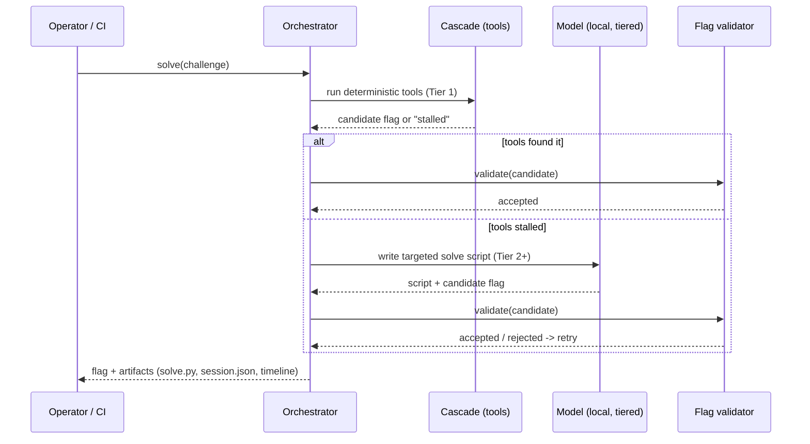
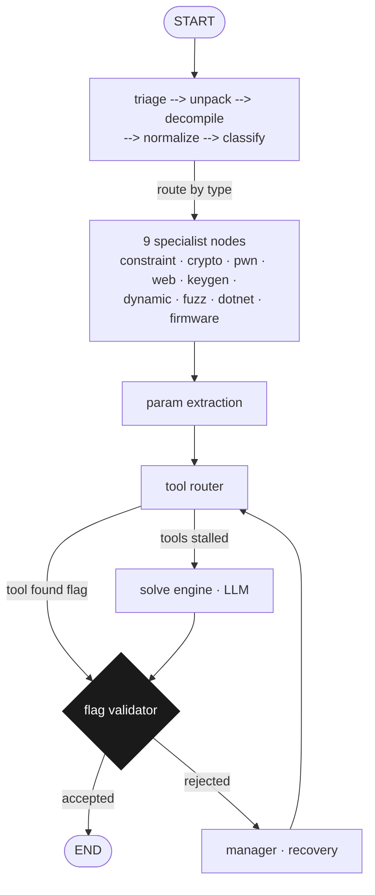
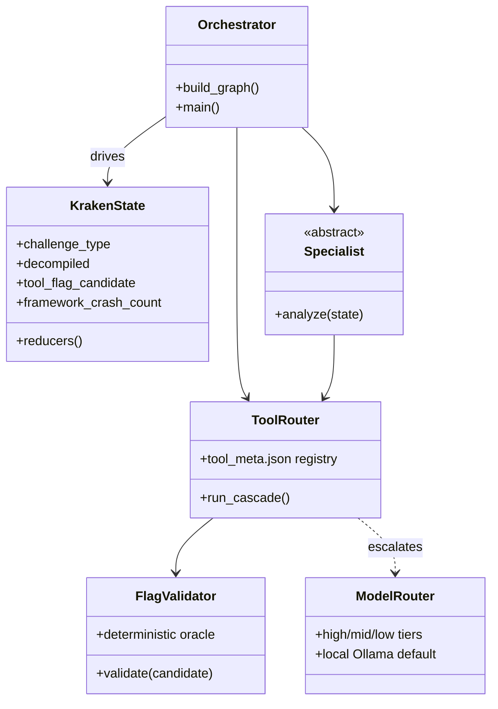

# KRAKEN: Technical Documentation

Deep technical reference for the KRAKEN reverse-engineering and CTF-solving system. Covers the MCP server, standalone graph architecture, node pipeline, tool cascade, evolution phases, LLM backend abstraction, and how the benchmark results were measured.

---

## Table of Contents

1. [System Overview](#system-overview)
2. [MCP Server Architecture](#mcp-server-architecture)
3. [Web GUI](#web-gui)
4. [Graph Architecture (Standalone)](#graph-architecture)
5. [State Machine](#state-machine)
6. [Node Pipeline (20 Nodes)](#node-pipeline)
7. [Deterministic Tool Cascade](#deterministic-tool-cascade)
8. [LLM Backend Abstraction](#llm-backend-abstraction)
9. [Attack/Defense Engine](#attackdefense-engine)
10. [Flag Validation Pipeline](#flag-validation-pipeline)
11. [Evolution Architecture](#evolution-architecture)
12. [Benchmark Results](#benchmark-results)
13. [Output and Artifact Management](#output-and-artifact-management)
14. [Development Journey: 26% to 100%](#development-journey)

---

## System Overview

KRAKEN is a deterministic-first reverse-engineering toolkit and CTF challenge solver. It operates in three modes:

1. **MCP Server**, Exposes 30 deterministic tools to Claude Code via stdio. Claude Code provides the reasoning; Kraken provides specialized RE tooling. No LLM calls inside the server.
2. **Standalone Solver**, Full LangGraph pipeline with 20 nodes, 4 LLM backends, autonomous end-to-end solving.
3. **Web GUI**, Browser-based interface for visual solving, batch operations, and real-time progress monitoring. Runs on `localhost:7777`.

The core philosophy: **tools produce facts, LLMs reason about facts.** Build deterministic solvers that extract flags through computation, and only invoke the model when the tools can't.

A solve descends the cascade cheapest-first and stops at the first tier that produces a flag the deterministic validator accepts:



### Measured results

These are development-time measurements on the local, offline `$0` cascade. Both benchmarks were run on the non-Docker subset a local configuration can exercise (19 of Cybench's 40 tasks; 23 of CTFTiny's larger set), not the full benchmarks. The live-CTF wins were produced by the orchestration harness driving stronger models, a different configuration from the `$0` local cascade. See [`paper/kraken_whitepaper.tex`](../paper/kraken_whitepaper.tex) for the full account.

- **Cybench (non-Docker subset): 19/19 (100%)**, single local 20B model, `$0`, committed run log in development.
- **CTFTiny (subset): 23/23 (100%)**, 21/23 solved with **zero LLM inference** (pure deterministic cascade); 39-second median; `$0` on a local 20B model.

### Technology Stack
| Component | Technology |
|-----------|-----------|
| Graph engine | LangGraph `StateGraph` |
| State | `KrakenState` TypedDict (~48 fields) |
| Configuration | Pydantic `BaseSettings` with env var binding |
| Logging | `structlog` (structured JSON) |
| Binary analysis | Ghidra (headless), capstone, pwntools, lief |
| Constraint solving | angr, Z3 |
| Cryptography | pycryptodome |
| LLM backends | Claude CLI, Anthropic SDK, OpenAI SDK, Ollama |
| Web GUI | FastAPI + Alpine.js (optional `[gui]` extra) |

---

## MCP Server Architecture

### Design Rationale

Kraken's LLM orchestration (classify, solve_engine, manager) poorly replicates what Claude Code does natively. The deterministic tools (triage, decompile, 59 helpers, flag validation) are the real value. The MCP server exposes only these tools, letting Claude Code serve as the orchestrator.

### Implementation (`mcp_server.py`)

Single-file FastMCP server with 30 tools, communicating via stdio. Each tool wraps existing Kraken modules, no logic duplication.

```python
from fastmcp import FastMCP

mcp = FastMCP("kraken")

@mcp.tool()
async def kraken_triage(challenge_path: str, flag_format: str = ...) -> dict:
    state = initial_state(challenge_id="mcp", challenge_path=challenge_path, ...)
    result = await triage(state)
    return {
        "binary_info": result.get("binary_info", {}),
        "strings_of_interest": result.get("strings_of_interest", []),
        # ... filtered response
    }
```

### Tool → Module Mapping

| MCP Tool | Wraps | Key Imports |
|----------|-------|-------------|
| `kraken_triage` | `nodes.triage.triage()` | `state.initial_state` |
| `kraken_decompile` | `nodes.decompile.decompile()` | `state.initial_state` |
| `kraken_extract_params` | `tools.param_extractor.extract_solve_params()` | Direct call |
| `kraken_run_tool` | `nodes.tool_router._build_tool_command()`, `_run_tool()`, `_check_for_flag()` | Falls back to direct `python3 helpers/{tool}.py` |
| `kraken_run_tool_cascade` | `nodes.tool_router.tool_router()` | Composes state from optional triage/decompile results |
| `kraken_validate_flag` | `nodes.flag_validator._is_likely_printable_flag()`, `_is_suspicious_low_diversity_flag()`, `_normalized_flag_pattern()`, `_verify_flag_with_binary()` | Async binary verification |
| `kraken_run_script` | `tools.script_executor.execute_script()` | Direct call |
| `kraken_full_solve` | Composes triage → decompile → extract → cascade → validate | Auto-logs retrospective + perf DB |
| `kraken_pwn_solve` | `subprocess.run` → `helpers/auto_pwn_solve.py` | ret2win, ret2libc, ROP, format string |
| `kraken_web_exploit` | `subprocess.run` → `helpers/auto_web_exploit.py` | SQLi, SSTI, SSRF, LFI |
| `kraken_docker_solve` | `subprocess.run` → `helpers/auto_docker_solve.py` | Docker build, attack, cleanup |
| `kraken_gdb_solve` | `subprocess.run` → `helpers/auto_gdb_solve.py` | GDB scripting, strcmp hook |
| `kraken_process_interact` | `subprocess.run` → `helpers/auto_process_interact.py` | Multi-round process interaction |

### State Construction

MCP tools construct minimal `KrakenState` via `initial_state()` for each invocation. Tools like `kraken_run_tool_cascade` accept optional enrichment data (`triage_result`, `decompile_result`, `extracted_params`) that gets merged into state before calling the underlying node function.

### Error Handling

Every tool wraps its body in try/except, returning `{"error": str, "error_type": str, "tool": str}` on failure. The server never crashes from a tool invocation.

### Transport

stdio (standard MCP transport). Entry point: `kraken.mcp_server:main`, installed as `kraken-mcp` console script.

---

## Web GUI

### Overview

KRAKEN includes a web-based GUI for visual challenge solving, batch operations, and real-time progress monitoring. The GUI runs as a local web server on port 7777 with zero build step, no Node.js, no bundler, no compilation.

### Quick Start

```bash
# Install GUI dependencies
pip install -e ".[gui]"

# Launch the GUI
kraken-gui

# Or with custom settings
kraken-gui --port 8080 --host 0.0.0.0
```

Open `http://localhost:7777` in a browser.

### Architecture

| Layer | Technology | Description |
|-------|-----------|-------------|
| Backend | FastAPI + Uvicorn | REST API + WebSocket server |
| Frontend | Alpine.js (CDN) | Reactive UI, zero build step |
| Styling | Custom CSS | Dark theme with electric teal (#00d4aa) accent |
| Real-time | WebSocket | Live event streaming during solves |
| Persistence | JSON file | Job history at `~/.kraken/gui_history.json` |

### Package Layout

```
src/kraken/gui/
├── __init__.py          # kraken-gui entry point
├── app.py               # FastAPI application (~490 lines)
├── jobs.py              # Job/JobStore/SolveEvent models
└── static/
    ├── index.html       # Single-page application (~830 lines)
    ├── app.js           # Alpine.js application logic (~720 lines)
    └── style.css        # Full theme (~1150 lines)
```

### REST API Endpoints

| Method | Path | Description |
|--------|------|-------------|
| GET | `/api/health` | Health check (uptime, version) |
| GET | `/api/pipeline` | Graph node topology for visualization |
| GET | `/api/tools` | List all available helper tools |
| GET | `/api/solves` | List all jobs (paginated) |
| GET | `/api/jobs` | Alias for `/api/solves` |
| GET | `/api/solve/{id}` | Get job details with events |
| POST | `/api/solve` | Start a single solve |
| DELETE | `/api/solve/{id}` | Cancel a running solve |
| POST | `/api/batch-solve` | Start batch solve (directory of challenges) |
| GET | `/api/batch-status` | Aggregate batch progress |
| GET | `/api/batch/{batch_id}` | Per-batch job list |
| GET | `/api/stats` | Solver statistics (solves, rate, timing) |
| GET | `/api/stats/cascade` | Current cascade configuration |
| POST | `/api/validate` | Validate a flag against a regex |
| POST | `/api/triage` | Run triage on a challenge path |
| POST | `/api/decompile` | Run decompilation on a challenge path |
| POST | `/api/run-tool` | Run a specific helper tool |
| POST | `/api/run-cascade` | Run the full tool cascade |
| GET | `/api/browse` | Browse filesystem for challenge directories |
| GET | `/api/config` | Current KRAKEN configuration |
| GET | `/` | Serve the single-page application |

### WebSocket Protocol

Real-time solve progress is streamed via WebSocket at `/ws/solve/{job_id}`:

```
Client connects → /ws/solve/{job_id}
Server sends → {"node": "triage", "status": "started", "data": {...}}
Server sends → {"node": "triage", "status": "completed", "data": {...}, "duration_s": 2.1}
Server sends → {"node": "decompile", "status": "started", ...}
...
Server sends → {"node": "flag_validator", "status": "completed", "data": {"flag": "flag{...}"}}
Server sends → "__done__"
Client disconnects
```

Each event is a `SolveEvent` with `node`, `status`, optional `data`, `duration_s`, and `timestamp`. The `__done__` sentinel signals solve completion (success, failure, or cancellation).

### Job Management

Jobs are managed by `JobStore` (in-memory + disk persistence):

- **Creation**: `POST /api/solve` creates a `Job` with unique 8-char hex ID
- **Status tracking**: `PENDING` → `RUNNING` → `COMPLETED` | `FAILED` | `CANCELLED`
- **Event streaming**: Each graph node emits start/complete events via pub/sub
- **Persistence**: Completed jobs are saved to `~/.kraken/gui_history.json` (truncated: 50 events/job, 500 chars/field)
- **Trimming**: Oldest completed jobs are evicted when `max_jobs` (default 100) is exceeded

### Batch Solve

`POST /api/batch-solve` accepts a directory path and optional concurrency limit:

```json
{
  "directory": "/path/to/challenges",
  "flag_format": "flag{}",
  "concurrency": 3
}
```

The backend discovers `challenge.json` files in subdirectories, pre-creates jobs for all challenges, and executes them with `asyncio.Semaphore`-based concurrency control. Each job in the batch shares a `batch_id` for grouped status queries via `GET /api/batch/{batch_id}`.

### Frontend Features

- **Pipeline visualization**: Interactive node graph showing solve progress
- **Real-time events**: WebSocket-driven event log with auto-scroll and node highlighting
- **Batch results table**: Sortable table with per-challenge status, flags, and timing
- **Decompile viewer**: Syntax-highlighted decompilation output
- **Challenge browser**: Filesystem navigator for selecting challenge directories
- **Tool runner**: Execute individual tools or the full cascade from the UI
- **Flag validator**: Test flag candidates against regex patterns
- **Copy buttons**: One-click copy for flags, decompiled code, and tool output
- **Search/filter**: Filter jobs and events by status, type, or text
- **Keyboard shortcuts**: `Ctrl+Enter` to solve, `Escape` to cancel
- **Toast notifications**: Non-blocking status messages for user actions
- **Export**: Download solve results as JSON

### Dependencies

GUI dependencies are optional and isolated in `pyproject.toml`:

```toml
[project.optional-dependencies]
gui = [
    "fastapi>=0.110.0",
    "uvicorn[standard]>=0.27.0",
    "websockets>=12.0",
]
```

Install with `pip install -e ".[gui]"` or `pip install -e ".[all]"`.

### Testing

28 tests cover the GUI backend (`tests/unit/test_gui.py`):

- **Job model tests** (6): creation, elapsed time calculation, serialization, batch ID tracking
- **SolveEvent tests** (1): event creation with timestamps
- **JobStore tests** (6): CRUD, listing, batch tracking, trimming, save/load persistence
- **API endpoint tests** (15): health, pipeline, tools, solves, batch, validation, error handling (requires `httpx`)

```bash
# Run GUI tests
pytest tests/unit/test_gui.py -v

# Run API tests (requires httpx)
pip install httpx
pytest tests/unit/test_gui.py -v -k TestAPI
```

---

## Graph Architecture

### Topology



### Graph Construction (`graph.py`)

The graph is assembled in `build_graph()` with two key wrappers applied to every node:

**`_safe_node(func)`**, Crash resilience wrapper. Catches unhandled exceptions from any node, logs the error, increments `framework_crash_count`, and routes to `manager` for recovery. After 8 cumulative crashes, routes to `__end__` as a hard brake.

```python
@functools.wraps(func)
async def wrapper(state):
    try:
        return await func(state)
    except Exception as exc:
        crash_count = int(state.get("framework_crash_count", 0) or 0) + 1
        updates = {
            "error_log": [{"node": func.__name__, "error": f"Unhandled: {exc}"}],
            "next_node": "manager",
            "framework_crash_count": crash_count,
        }
        if crash_count >= 8:
            updates["next_node"] = "__end__"
        return updates
```

**`_cached_node(func, cache_fields)`**, Deterministic caching. Skips re-execution if all specified result fields already exist in state. Prevents redundant Ghidra runs, duplicate triage, etc.

### Conditional Routing

Two critical routing decisions:

1. **After `classify`**, Routes to 1 of 9 specialist nodes based on `challenge_type`:
   - `constraint_solver`, `crypto_decode`, `dynamic_analysis`, `keygen`, `pwn_specialist`
   - `fuzzing_specialist`, `web_specialist`, `dotnet_specialist`, `firmware_specialist`

2. **After `tool_router`**, If `tool_flag_candidate` is set (a tool found a flag), routes to `flag_validator`. Otherwise routes to `solve_engine` for LLM-based solving.

3. **After `flag_validator`**, If flag accepted, routes to `__end__` (success). If rejected, routes to `manager` for strategic recovery (retry with different approach, re-run tools, etc.).

---

## State Machine

### Component Model

The orchestrator drives a single `KrakenState` through the graph, routing between the deterministic tool router and the model-backed specialists, and gating every candidate flag through the deterministic validator:



### KrakenState TypedDict

The central state object flows through all 20 nodes. ~48 fields organized by concern:

```python
class KrakenState(TypedDict):
    # ── Identity ──
    challenge_id: str
    challenge_path: str
    challenge_description: str
    flag_format: str
    category: str

    # ── Binary analysis (triage) ──
    binary_info: dict
    strings_of_interest: list[str]
    challenge_files: dict          # {filename: file_info} for directory challenges

    # ── Decompilation ──
    decompiled_functions: dict     # {func_name: decompiled_source}
    function_annotations: dict     # Human-readable names from normalize

    # ── Classification ──
    challenge_type: str            # constraint, crypto, dynamic, keygen, ...
    secondary_types: list[str]     # Ambiguous challenges get multiple types

    # ── Specialist output ──
    specialist_analysis: str       # Domain-specific analysis text

    # ── Parameter extraction ──
    extracted_params: dict         # {input_mode, success_string, flag_format, key_constants, ...}

    # ── Tool cascade ──
    tool_results_summary: str      # Combined output from all tools
    tool_flag_candidate: str       # Best flag candidate from tools

    # ── Solve engine ──
    solve_scripts: Annotated[list[dict], operator.add]  # Generated scripts + results
    current_strategy: str
    strategies_tried: Annotated[list[str], operator.add]

    # ── Flag ──
    flag: str                      # Final accepted flag

    # ── Control flow ──
    next_node: str
    iteration_count: int
    framework_crash_count: int
    benchmark: bool                # Benchmark mode flag

    # ── Evolution (Phase 1) ──
    artifact_store_path: str
    decompiled_functions_handle: str
    angr_results_handle: str
    dynamic_traces_handle: str
```

### Reducer Pattern

List fields use `Annotated[list[T], operator.add]` to enable LangGraph's additive reducer. When a node returns `{"solve_scripts": [new_script]}`, LangGraph appends rather than overwrites:

```python
solve_scripts: Annotated[list[dict], operator.add]
strategies_tried: Annotated[list[str], operator.add]
error_log: Annotated[list[dict], operator.add]
recent_actions: Annotated[list[str], operator.add]
```

---

## Node Pipeline

### Phase 1: Information Gathering (No LLM)

#### `triage`, Binary Metadata
- **LLM**: None
- **Runs**: `file`, `checksec`, strings extraction, entropy analysis, encoding detection
- **Directory handling**: Auto-detects the most likely binary by magic bytes (`\x7fELF`, `MZ`), executable bit, and size
- **Concurrent**: All analyses run via `asyncio.gather()`
- **Outputs**: `binary_info`, `strings_of_interest`, `challenge_files`

#### `unpack`, Decompression
- **LLM**: None
- **Runs**: UPX detection and decompression (`upx -d`)
- **Fallback**: Dynamic dump for custom packers
- **Outputs**: Updated `challenge_path` if unpacked

#### `decompile`, Disassembly
- **LLM**: None
- **Primary**: Ghidra headless with `analyzeHeadless` (auto-detects installed Ghidra via `GHIDRA_INSTALL_DIR`)
- **Fallback**: Capstone linear disassembly for architectures Ghidra can't handle
- **Artifact store**: When Phase 1 is enabled, stores decompiled functions as content-addressed artifacts and writes the handle to state
- **Outputs**: `decompiled_functions` (dict of function_name → decompiled C source)

### Phase 2: LLM-Assisted Analysis

#### `normalize`, Variable Annotation
- **LLM**: Low tier
- **Purpose**: Renames obfuscated variables (`v1`, `a2`, `local_48`) to human-readable names
- **Outputs**: `function_annotations`

#### `classify`, Challenge Type Routing
- **LLM**: Mid tier
- **Method**: Three-tier classification with graceful degradation:
  1. **Structured output**, JSON schema for `{challenge_type, confidence, reasoning}`
  2. **JSON parse fallback**, Regex extraction from unstructured text
  3. **Heuristic fallback**, Keyword matching on decompiled source (`strcmp` → constraint, `AES` → crypto, etc.)
- **Outputs**: `challenge_type`, `secondary_types`, `specialist_analysis`

### Phase 3: Domain Specialists (9 nodes)

Each specialist performs domain-specific analysis to guide parameter extraction and tool selection:

| Specialist | Focus |
|-----------|-------|
| `constraint_solver` | strcmp/memcmp patterns, loop bounds, comparison arrays |
| `crypto_decode` | Cipher identification, key extraction, mode detection |
| `dynamic_analysis` | Anti-debug detection, runtime behavior, I/O patterns |
| `keygen` | Serial/license validation logic, registration schemes |
| `pwn_specialist` | Buffer overflows, format strings, ROP chains |
| `fuzzing_specialist` | Input mutation strategies, coverage guidance |
| `web_specialist` | SQLi, XSS, SSRF, command injection |
| `dotnet_specialist` | .NET IL analysis, DnSpy integration |
| `firmware_specialist` | Firmware extraction, embedded protocol analysis |

### Phase 4: Deterministic Extraction

#### `param_extraction`, Regex Parameter Mining
- **LLM**: None
- **Extracts**: `input_mode` (stdin/argv/file), `success_string`, `flag_format`, `key_constants`, `comparison_values`, `loop_bounds`
- **Method**: Pure regex over decompiled source, no LLM inference
- **Outputs**: `extracted_params`

#### `tool_router`, Deterministic Tool Cascade
- **LLM**: None
- **Core innovation**: Runs up to 19 universal tools + type-specific tools before any LLM call
- **Short-circuit**: If any tool finds a valid flag, immediately routes to `flag_validator`
- See [Deterministic Tool Cascade](#deterministic-tool-cascade) section for details

### Phase 5: LLM Solving (Only if tools fail)

#### `solve_engine`, LLM Script Generation
- **LLM**: High tier
- **Method**: Generates Python solve scripts, executes them in sandbox, captures output
- **Context**: Receives decompiled functions, extracted parameters, tool results summary, attempt history
- **Template selection**: Chooses between full and compact Jinja2 templates based on context size
- **Linting**: Pre-execution linter catches common errors (syntax, missing imports, infinite loops)
- **Outputs**: `solve_scripts`, `tool_flag_candidate` (if script produces a flag)

### Phase 6: Validation and Recovery

#### `flag_validator`, Flag Acceptance
- **LLM**: None
- **Pipeline**: Regex match → printability check → low-diversity filter → hallucination detector → prefix-wrap reject list
- **Outputs**: `flag` (if accepted) or rejection reason

#### `manager`, Strategic Recovery
- **LLM**: High tier
- **Purpose**: Analyzes failure patterns, selects next strategy, can re-route to any node
- **Strategies**: Re-classify, try different specialist, adjust tool parameters, try different solve approach
- **Budget**: Respects `max_strategies` and `max_solve_attempts` limits
- **Outputs**: `current_strategy`, `next_node`

#### `context_compressor`, Token Budget Management
- **LLM**: Low tier
- **Purpose**: Compresses conversation history to fit within context window for retry loops
- **Outputs**: Compressed `working_memory`

---

## Deterministic Tool Cascade

The tool cascade is the core innovation. A set of universal tools runs for EVERY challenge type before the LLM gets a chance, followed by type-specific tools chosen from the classifier's verdict.

The ordering is data, not code: `src/kraken/helpers/registry.py` reads `src/kraken/helpers/tool_meta.json` (the single source of truth for tool metadata, the `universal_order` list, and the per-type `type_specific` lists). `tool_router`, the optimizer, and the MCP server all consume this registry; `tool_router` falls back to hardcoded lists only when the JSON is missing. Adding or reordering a tool means editing `tool_meta.json` alone.

### Universal Tools (run for all challenges)

The `universal_order` list from the registry (illustrative):

```python
universal_order = [
    "auto_source_decode",         # Decode base64/hex/chr/shell from source files
    "auto_constraint_extract",    # Extract JS/Python char-by-char constraints + XOR arrays
    "auto_run_static",            # Run binary with no input (catches static flag printers)
    "auto_python_reverse",        # Run solver/exploit scripts from challenge dir
    "auto_c_source_eval",         # Extract flags from C source (hex comments, macros)
    "auto_cpp_compile",           # Compile C/C++/ASM source and run for flag extraction
    "auto_qr_decode",             # Decode QR codes from text/bitmap data
    "auto_maze_solver",           # Solve maze challenges (PyTorch, text)
    "auto_archive_search",        # Search archives (tar/zip/Docker) for flags
    "auto_git_extract",           # Extract flags from git-based challenges (zip with .git)
    "auto_table_reverse",         # Reverse substitution-table ciphers (table-inc.h)
    "auto_ec_vigenere",           # Solve EC-Vigenere (ECXOR) via known-plaintext attack
    "auto_hash_crack",            # Crack password hashes with description hints
    "auto_pdf_extract",           # Extract text from PDFs and scan for flags
    "auto_pcap_extract",          # Extract flags from PCAP network captures
    "auto_steg_extract",          # Extract hidden data from images (LSB, EXIF, appended)
    "auto_file_carve",            # Carve embedded files and scan for flags
    "auto_substitution_cipher",   # Caesar, Vigenere, Atbash, affine, frequency analysis
    "auto_bash_solver",           # Find and execute bash solver scripts with path adaptation
]
```

### Type-Specific Tools (run after universal)

The `type_specific` map from the registry (illustrative):

```python
type_specific = {
    "constraint": ["auto_angr", "auto_regex_z3", "auto_gdb_cmp"],
    "crypto":     ["auto_xor_brute", "auto_c_brute", "auto_c_rand", "auto_rsa_attack", "auto_lattice_attack"],
    "keygen":     ["auto_angr", "auto_gdb_cmp", "auto_c_brute", "auto_c_rand"],
    "dynamic":    ["auto_gdb_cmp", "auto_angr", "auto_dynamic_trace", "auto_gdb_solve", "auto_memory_dump"],
    "dotnet":     ["auto_angr"],
    "pwn":        ["auto_pwn_solve", "auto_heap_exploit", "auto_gdb_cmp", "auto_pwn_template", "auto_rop_extract"],
    "forensics":  ["auto_pcap_extract", "auto_steg_extract", "auto_file_carve", "auto_forensics_advanced"],
    "steg":       ["auto_steg_extract", "auto_file_carve"],
    "fuzzing":    ["auto_angr"],
    "web":        ["auto_web_exploit", "auto_directory_scan", "auto_jwt_crack"],
    "firmware":   ["auto_focused_decompile", "auto_deobfuscate"],
    "scripting":  ["auto_vm_analyze", "auto_deobfuscate"],
}
```

### Cascade Execution Logic

1. Build ordered tool list: universal tools first, then type-specific
2. For each tool:
   - Build command from `extracted_params` + state
   - Execute with timeout (60-120s depending on type)
   - Parse stdout for flag patterns
   - **Skip false positives**: If candidate matches repetitive-char pattern (e.g., `flag{^^^^^^^^}`), skip and continue
   - **Shell expression filter**: Reject candidates containing unexpanded shell syntax (e.g., `flag{"$(<flag.txt)"}`)
   - **Incomplete repair**: If candidate looks truncated (e.g., `flag{body`), append `}`
   - **Prefix-wrap detection**: If body-only output matches (e.g., `r3vers!nG_w@rm_Up`), wrap with known flag prefix
   - **Reject-list check**: Block error words (`WRONG`, `ERROR`, `FAIL`, `INVALID`, `INCORRECT`) from becoming false flags
3. First valid candidate → set `tool_flag_candidate` → route to `flag_validator`
4. No valid candidate → route to `solve_engine`

### Representative Tool Implementations

The tree ships 100+ analysis helpers (85 wired into the router via the registry). A representative slice:

| Tool | Lines | Technique |
|------|-------|-----------|
| **Universal** | | |
| `auto_source_decode` | ~120 | Decode base64/hex/chr/shell obfuscation from source files |
| `auto_constraint_extract` | ~150 | Extract char-by-char JS/Python constraints, solve XOR arrays |
| `auto_run_static` | ~60 | Run binary with no input (catches static flag printers) |
| `auto_python_reverse` | ~80 | Discover and execute solver scripts in challenge directory |
| `auto_c_source_eval` | ~150 | Parse Ghidra decompilation for hex arrays, reverse encoding |
| `auto_qr_decode` | ~200 | Reconstruct QR matrix from decimal text, Reed-Solomon decode |
| `auto_maze_solver` | ~100 | BFS on PyTorch tensor maze, MD5 hash path |
| `auto_archive_search` | ~180 | Walk tar/zip/Docker layers, scan for flag patterns, decode base64 |
| `auto_git_extract` | ~200 | Walk all git branches/commits, decompile `.pyc`, extract secrets |
| `auto_table_reverse` | ~80 | Parse `{src, dst}` pairs from C headers, build reverse map, decrypt |
| `auto_ec_vigenere` | ~300 | Inline Ed25519 point arithmetic, known-plaintext attack, ngram scoring |
| `auto_pdf_extract` | ~100 | Extract text from PDFs and scan for flag patterns |
| `auto_pcap_extract` | ~150 | Extract flags from PCAP network captures (TCP reassembly, HTTP) |
| `auto_steg_extract` | ~200 | Steganography extraction (LSB, EXIF metadata, appended data) |
| `auto_file_carve` | ~120 | Carve embedded files from binaries, scan for flags |
| `auto_substitution_cipher` | ~250 | Caesar, Trithemius, Vigenere, Atbash, affine, frequency analysis |
| `auto_hash_crack` | ~100 | Crack password hashes with description-derived hints |
| `auto_bash_solver` | ~170 | Find and execute bash solver scripts with path adaptation |
| **Constraint/Keygen** | | |
| `auto_angr` | ~200 | Symbolic execution with Z3 constraint solving |
| `auto_angr_advanced` | ~800 | Advanced angr: state pruning, function hooks, backward exploration |
| `auto_regex_z3` | ~150 | Direct Z3 from regex-extracted comparison values |
| `auto_gdb_cmp` | ~180 | GDB breakpoint on `strcmp`/`memcmp`, reads expected value from registers |
| `auto_c_brute` | ~120 | Character-by-character brute force via binary feedback |
| `auto_patcher` | ~100 | Patch anti-debug checks, NOP out failure paths |
| **Crypto** | | |
| `auto_xor_brute` | ~100 | All single-byte and multi-byte XOR keys, ASCII ratio scoring |
| `auto_crypto` | ~80 | Known cipher pattern matching (AES, RSA, DES) |
| `auto_c_rand` | ~80 | Predict C `rand()` sequences from known seeds |
| `auto_rsa_attack` | ~400 | RSA attacks: small e, Wiener, Fermat, common modulus, Pollard p-1, Coppersmith |
| `auto_lattice_attack` | ~400 | ECDSA nonce, GCD moduli, LLL, BSGS, Pohlig-Hellman, CRT |
| **Pwn** | | |
| `auto_pwn_solve` | ~1800 | Full exploitation: ret2win, ret2libc, ROP chains, format string, shellcode |
| `auto_heap_exploit` | ~1050 | Heap exploitation: tcache poisoning, fastbin dup, UAF, unsorted bin |
| `auto_kernel_pwn` | ~1130 | Kernel pwn: KASLR bypass, modprobe_path, initramfs extraction |
| `auto_pwn_template` | ~180 | Checksec, overflow detection, vulnerability analysis |
| `auto_rop_extract` | ~150 | ROP gadget extraction and chain building |
| **Web** | | |
| `auto_web_exploit` | ~1860 | SQLi, SSTI, SSRF, LFI, command injection, deserialization, XSS |
| `auto_jwt_crack` | ~500 | JWT attacks: none algorithm, weak secret, kid injection |
| `auto_directory_scan` | ~720 | Endpoint discovery, git exposure, virtual host fuzzing |
| **Dynamic Analysis** | | |
| `auto_gdb_solve` | ~900 | GDB Python scripting: strcmp hook, anti-debug bypass, runtime decrypt |
| `auto_process_interact` | ~1000 | Multi-round process/service interaction, PoW solving |
| `auto_memory_dump` | ~850 | Runtime memory extraction, /proc/pid/mem dump, crypto key detection |
| `auto_vm_analyze` | ~1100 | Custom VM/bytecode analysis: opcode extraction, Z3 symbolic solve |
| `auto_dynamic_trace` | ~250 | Binary tracing via strace/ltrace for flag extraction |
| **Advanced RE** | | |
| `auto_focused_decompile` | ~1050 | Smart decompilation for large binaries (function triage, call graph) |
| `auto_deobfuscate` | ~1050 | UPX unpack, string decrypt, control flow unflatten |
| `auto_binary_diff` | ~750 | Binary diffing for A/D patch analysis and vuln identification |
| **Infrastructure** | | |
| `auto_docker_solve` | ~860 | Docker challenge orchestration: build, start, attack, cleanup |
| `auto_service_interact` | ~690 | Generic network service fingerprinting and interaction |
| `auto_forensics_advanced` | ~910 | Memory dumps, disk images, registry, browser artifact forensics |
| **Network** | | |
| `auto_remote_interact` | ~120 | TCP service interaction for network challenges |
| `auto_timing_attack` | ~100 | Parallel timing side-channel attack |

---

## LLM Backend Abstraction

### Four Backends

KRAKEN supports four LLM backends through a unified interface in `models.py`:

```python
async def direct_generate(prompt, tier, config, *, num_predict=4096) -> str:
    """Backend-agnostic text generation."""
    if config.backend == "claude":      # Claude CLI (subprocess)
    elif config.backend == "anthropic": # Anthropic SDK (API)
    elif config.backend == "openai":    # OpenAI SDK (API)
    else:                               # Ollama (direct HTTP)
```

### Three-Tier Model Routing

| Tier | Purpose | Default (Cloud) | Default (Ollama) |
|------|---------|-----------------|------------------|
| `high` | solve_engine, manager | sonnet-4.6 | gpt-oss-20b-131k |
| `mid` | classify, specialists | sonnet-4.6 | gpt-oss-20b-131k |
| `low` | normalize, compressor | haiku | gpt-oss-20b-131k |

### Ollama-Specific Configuration

```python
# Critical settings for Ollama:
num_ctx = 131072       # Default 2048 is too small for solve prompts
reasoning = False      # Prevents thinking models from burning tokens
think = False          # Same, for direct API calls
```

**Endpoint resolution**: Tries `host.docker.internal:11434` first (for WSL2/Docker), falls back to `localhost:11434`.

**Crash recovery**: If Ollama returns HTTP 500 or disconnects mid-generation, KRAKEN polls `/api/tags` every 5s for up to 60s, then retries. Between challenges, a pre-flight health check runs to detect and recover from Ollama crashes before starting the next solve.

### Claude CLI Fallback

When using the Claude backend, authentication failures automatically fall back to Ollama if available:

```python
def _should_fallback_to_ollama(exc: Exception) -> bool:
    """Detect Claude auth errors that should trigger Ollama fallback."""
    # API key expired, rate limited, etc.
```

---

## Attack/Defense Engine

KRAKEN includes a complete attack/defense (A/D) CTF engine for DEF CON Finals-style competitions. The engine operates in tick-based rounds, simultaneously running offense (exploit deployment, flag submission) and defense (traffic analysis, auto-patching, SLA monitoring).

### Architecture (`src/kraken/ad/`)

```
ad/
├── engine.py              # Tick-based game loop (asyncio.gather offense + defense)
├── config.py              # YAML config with environment variable substitution
├── cli.py                 # CLI with 7 subcommands
├── offense/
│   ├── exploit_manager.py # Exploit registry, lifecycle, scoring
│   ├── thrower.py         # Parallel exploit deployment across teams
│   ├── flag_submitter.py  # Flag queue, dedup, batch submission
│   └── vuln_scanner.py    # Automated vulnerability scanning
├── defense/
│   ├── traffic_analyzer.py # PCAP/netflow analysis, attack pattern detection
│   ├── patcher.py         # Binary patching with SLA verification
│   ├── sla_monitor.py     # Service uptime monitoring, health checks
│   └── firewall.py        # Dynamic iptables/nftables rule management
└── infra/
    ├── team_manager.py    # Team registry, IP ranges, credentials
    ├── network.py         # Network topology, connectivity management
    ├── scoreboard.py      # Score tracking, flag accounting
    └── docker_manager.py  # Service container orchestration
```

### Game Loop

Each tick executes offense and defense in parallel:

1. **Offense**: Scan targets → deploy exploits → collect flags → submit flags
2. **Defense**: Analyze traffic → detect attacks → patch vulnerabilities → verify SLA
3. **Bookkeeping**: Update scoreboard, log telemetry, rotate exploits

### CLI

```bash
kraken-ad start config.yaml          # Start the A/D engine
kraken-ad exploit add exploit.py     # Register a new exploit
kraken-ad patch apply binary.patched # Deploy a patch
kraken-ad traffic analyze capture.pcap # Analyze traffic
kraken-ad scan targets.txt           # Scan for vulnerabilities
kraken-ad status                     # Engine status dashboard
kraken-ad scoreboard                 # Live scoreboard
```

### Integration with Kraken Tools

The A/D engine leverages existing Kraken helpers:
- `auto_binary_diff`, Diff patched binaries against originals to find vulnerabilities
- `auto_pwn_solve`, Auto-generate exploits for discovered vulnerabilities
- `auto_pcap_extract`, Analyze captured traffic for flags and attack patterns
- `auto_focused_decompile`, Rapid decompilation of opponent service binaries
- `auto_deobfuscate`, Strip protections from opponent binaries

---

## Flag Validation Pipeline

Flags pass through 5 validation stages before acceptance:

### Stage 1: Regex Match
Matches against the challenge's `flag_format` regex. Supports standard `flag{...}` format, custom prefixes (`csawctf{}`), and raw strings (no braces).

### Stage 2: Printability Check (`_is_likely_printable_flag`)
All bytes must be in ASCII range [32, 126]. Rejects binary garbage that might match a flag pattern.

### Stage 3: CTF Body Validation (`_is_likely_ctf_body`)
- **Braced flags**: Body must be 4-200 characters, alphanumeric/special mix
- **Braceless flags**: Must be 4-200 characters, printable ASCII, matches `[A-Za-z0-9+/=_-]+`
- Handles both `flag{body}` and raw hash formats like `ca3412b55940568c5b10a616fa7b855e`

### Stage 4: Low-Diversity Filter (`_is_suspicious_low_diversity_flag`)
Rejects flags with suspiciously low character diversity:
- Single-char bodies like `flag{^^^^^^^^}` → rejected
- **Exceptions**: Binary strings (`01011100...`) and hex strings explicitly whitelisted

### Stage 5: Hallucination Detector (`_detect_hallucinated_flag`)
Catches LLM-fabricated flags via computation indicator analysis:
- Flags containing computation markers (`TODO`, `PLACEHOLDER`, `example`) → rejected
- Binary verification override: if the flag was extracted by a deterministic tool, skip this check

### Stage 6: Prefix-Wrap Reject List
When the tool cascade finds body text without a flag prefix, it wraps with the known prefix. But error messages must be blocked:
```python
_PREFIX_WRAP_REJECT = ["WRONG", "ERROR", "FAIL", "INVALID", "INCORRECT", "DENIED", ...]
```
This fixed the `tablez` challenge where `WRONG` was being wrapped into `flag{WRONG}`.

---

## Evolution Architecture

Five active modular extensions, each gated by feature flags in `EvolutionConfig`. Phases 2-3 (RAG system: reflexion, tree index, qdrant, experience store) were removed as dead weight, the 100% benchmark score is fully deterministic and gains nothing from learned experience.

```python
class EvolutionConfig(BaseSettings):
    model_config = SettingsConfigDict(env_prefix="KRAKEN_EVO_")

    enable_artifact_store: bool = True          # Phase 1
    # Phases 2-3 REMOVED (RAG system deleted)
    enable_schema_validation: bool = False       # Phase 4
    enable_subgraphs: bool = False               # Phase 5
    enable_parallel_specialists: bool = False     # Phase 6
    enable_delegation: bool = False               # Phase 7
```

### Phase 1: Artifact Store (`artifact_store.py`)

**Problem**: LangGraph checkpoints serialize the full state. Large fields like `decompiled_functions` (can be 100KB+) bloat checkpoint size and slow state transitions.

**Solution**: Content-addressed handle pattern. Large artifacts are stored externally as JSON files, keyed by `{type}:{sha256_prefix}`. State only holds a lightweight handle string.

```python
class ArtifactStore:
    def put(self, artifact_type: str, data: Any) -> str:
        """Store artifact, return handle."""
        key = f"{artifact_type}:{hashlib.sha256(json.dumps(data).encode()).hexdigest()[:12]}"
        (self.root / key).write_text(json.dumps(data))
        return key

    def get(self, handle: str) -> Any:
        """Retrieve artifact by handle."""
        return json.loads((self.root / handle).read_text())

def get_artifact(state: dict, field: str, handle_field: str) -> Any:
    """Transparent fallback: try handle first, then inline state field."""
    handle = state.get(handle_field, "")
    if handle:
        store_path = state.get("artifact_store_path", "")
        if store_path:
            return ArtifactStore(store_path).get(handle)
    # Fallback to inline state
    return state.get(field, _DEFAULTS.get(field, {}))
```

All 20 nodes migrated to use `get_artifact()` instead of direct `state["decompiled_functions"]` access.

### Phases 2-3: REMOVED (RAG System)

Phases 2 (Reflexion Loop) and 3 (Vectorless Tree RAG) were deleted in commit `0d00526`. The entire RAG system, qdrant, reflexion store, tree index, experience store, was removed as dead weight. The 100% benchmark score is fully deterministic; learned experience added zero value and introduced unnecessary complexity and dependencies.

### Phase 4: Node Schemas (`schemas.py`)

40 TypedDicts (20 input + 20 output) defining the narrow interface for each node:

```python
NODE_SCHEMAS = {
    "triage": (TriageInput, TriageOutput),
    "classify": (ClassifyInput, ClassifyOutput),
    "solve_engine": (SolveEngineInput, SolveEngineOutput),
    # ... 17 more
}

def validated_node(func):
    """Debug decorator: warns on schema violations, never blocks."""
    @functools.wraps(func)
    async def wrapper(state):
        result = await func(state)
        if os.environ.get("KRAKEN_DEBUG"):
            _validate_output(func.__name__, result)
        return result
    return wrapper
```

Validation is **debug-only**, never blocks production execution.

### Phase 5: Specialist Subgraphs (`nodes/specialists/`)

Each specialist becomes an isolated LangGraph `StateGraph` with private internal state:

```python
class ConstraintState(TypedDict):
    binary_path: str
    functions: dict
    params: dict
    stage: str          # "symbolic" or "fallback"
    symbolic_result: str
    final_analysis: str

# 2-node subgraph: symbolic → fallback
graph = StateGraph(ConstraintState)
graph.add_node("symbolic", symbolic_analysis)
graph.add_node("fallback", fallback_analysis)
```

**Gate**: `enable_subgraphs=False` by default. When disabled, original monolithic specialist functions run instead.

### Phase 6: Parallel Fan-Out (`nodes/specialist_fanout.py`)

For ambiguous challenges with multiple `secondary_types`, runs multiple specialists concurrently:

```python
async def specialist_fanout(state: KrakenState) -> dict:
    types_to_run = [state["challenge_type"]] + state.get("secondary_types", [])
    tasks = [_run_specialist(t, state) for t in types_to_run[:3]]
    results = await asyncio.gather(*tasks, return_exceptions=True)
    return _merge_results(results)
```

**Gate**: `enable_parallel_specialists=False` by default.

### Phase 7: Agent Delegation (`agents/delegate.py`)

solve_engine can spawn scoped sub-agents for complex subtask decomposition:

```python
@dataclass
class SubAgentTask:
    description: str
    context: str        # Scoped context (max 4K tokens)
    timeout: float = 30.0

async def delegate_subtask(task: SubAgentTask, config) -> SubAgentResult:
    """Execute a single sub-agent task with safety constraints."""
    # depth=1 (no recursive delegation)
    # 4K context window
    # 30s timeout
    # max 3 concurrent via asyncio.Semaphore
```

**Gate**: `enable_delegation=False` by default.

---

## Benchmark Results

The benchmark harness used to produce these numbers lives in the private development tree and is **not shipped** in this public release, so there is no benchmark CLI or committed dataset to run here. The results are reported as measured in development and documented in full in [`paper/kraken_whitepaper.tex`](../paper/kraken_whitepaper.tex).

What was measured, on the `$0` local cascade (single 20B model, offline), against the non-Docker subset a local configuration can exercise:

- **Cybench (non-Docker subset): 19/19 (100%)**, 19 of Cybench's 40 tasks.
- **CTFTiny (subset): 23/23 (100%)**, 21/23 solved with zero model inference for the flag-finding step (the deterministic cascade alone); 39-second median.

Both are subsets, not full-benchmark sweeps, and both are the `$0` local cascade configuration, distinct from the orchestration-driven configuration behind the live-CTF wins. The CTFTiny set draws from CSAW CTF (2017-2023): reverse engineering (constraint validation, obfuscation, symbolic execution), cryptography (DH, RSA, OTP, hash collision, EC-Vigenere), forensics (Docker layer extraction, XOR recovery), and miscellaneous (QR decode, maze solving, password comparison). Runs used no RAG or learned experience, that system was removed entirely (see [Evolution Architecture](#evolution-architecture)), so measurements are clean and reproducible from the same dataset, model, and tools.

---

## Output and Artifact Management

### Directory Structure

All solve artifacts are written under `results/` (runtime), alongside the challenge files. Each run gets a timestamped directory; each challenge gets its own solution workspace with the full reasoning trail:

```
results/                                 # Runtime solve outputs
├── run_0227_1934/                       # A solve-all / batch run
│   ├── kraken_results.json              # Concise results
│   ├── kraken_analytics.json            # Full results with timings
│   ├── solve_ledger.md                  # Markdown report
│   ├── summary.json                     # Aggregate statistics
│   └── kraken.log                       # Structured JSON log
│
└── {challenge}_solution_artifacts/      # Per-challenge workspace
    ├── WRITEUP.md            CTFd-format writeup (description, paragraphs, code, link, flag)
    ├── README.md             Technical writeup (approach, tools, key insights, metrics)
    ├── flag.txt              Captured flag
    ├── solve.py              Reproducible solve script
    ├── session.json          Machine-readable session metadata
    ├── auto_*.py             Injected helper scripts
    ├── solve_ledger.md       Per-challenge report
    └── artifacts/
        ├── triage.json         Binary info, strings, file type detection
        ├── analysis.json       Patterns found, key findings, observations
        ├── decompile.json      Disassembly / decompilation summary
        ├── cascade.json        Tools tried and their results
        ├── timeline.jsonl      Per-step timing trace
        ├── decisions.jsonl     Reasoning graph -- decision tree per step
        ├── dead_ends.md        Failed approaches with root cause analysis
        ├── annotated.asm       Objdump disassembly with inline comments
        ├── constraints.json    Formal puzzle model / solve equation
        ├── patches.json        Binary patch specifications
        ├── verify.sh           Independent flag verification script
        └── taxonomy.json       Difficulty classification and technique tags
```

### Enhanced Artifact Types

Seven additional artifact types capture the reasoning process, not just the result:

| Artifact | Purpose |
|----------|---------|
| `decisions.jsonl` | Reasoning graph, each step records observation, hypothesis, action, outcome, and dead ends |
| `dead_ends.md` | Failed approaches with root causes, negative knowledge for optimizer and learning |
| `annotated.asm` | Key disassembly sections with inline `; comments` explaining each instruction block |
| `constraints.json` | Formal model: cipher type, key derivation formula, ciphertext location, gate bypasses |
| `patches.json` | Binary patch specs: file offset, original/patched bytes, dd command, rationale |
| `verify.sh` | Independent verification, patches binary, runs it, compares output to expected flag |
| `taxonomy.json` | Techniques, difficulty factors, similar challenges, automation feasibility |

### Environment Variables

| Variable | Default | Description |
|----------|---------|-------------|
| `KRAKEN_SOLVE_WORKSPACE_BASE` | `results/` | Base directory for solve workspaces |
| `KRAKEN_SOLVE_WORKSPACE_USE_SUDO` | `1` | Allow passwordless sudo for mkdir/chown |
| `KRAKEN_SOLVE_WORKSPACE_FALLBACK` | `0` | Allow fallback to home/tmp on permission failure |

### Resume Support

The offline `kraken-runtime` provides session-level pause/resume: it serializes the full `KrakenState` after each graph step to `.kraken/sessions/`, and `kraken-runtime resume <session-id>` deserializes it and continues from the last persisted state. Deterministic artifacts (decompiled functions, binary info, strings) are preserved, so triage and decompile are skipped on resume via the caching wrapper. See [`RUNTIME_GUIDE.md -- Session Management`](RUNTIME_GUIDE.md#4-session-management).

---

## Development Journey

### Phase 1: Raw LLM (6/23, 26%)
Initial LangGraph + Ollama setup with no deterministic tools. The LLM hallucinated plausible-looking flags that didn't match ground truth. Every flag required LLM inference.

### Phase 2: Flag Validation (13/23, 57%)
Added flag validation guards: low-diversity filter caught repetitive-char hallucinations, hallucination detector caught computation markers. Context compressor enabled retry loops within token budget. +31 percentage points.

### Phase 3: Deterministic Tool Cascade (19/23, 83%)
Built the core tool cascade: `auto_c_source_eval`, `auto_qr_decode`, `auto_maze_solver`, `auto_angr`. The tool cascade alone added 26 percentage points. Key insight: **don't ask the LLM to do math**, use Z3, symbolic execution, and direct computation.

### Phase 4: Cascade Refinement (21/23, 91%)
Fixed `tool_flag_candidate` path in `flag_validator`. Added `auto_git_extract` and `auto_archive_search`. Cascade skip logic for false positives, if one tool produces garbage, remaining tools still run.

### Phase 5: Specialized Solvers (21/23, 91%)
Two custom solvers for cipher challenges:
- `auto_table_reverse`: Parses substitution cipher tables from C headers
- `auto_ec_vigenere`: Inline Ed25519 point arithmetic with known-plaintext attack
*(+2 solves but ground-truth checking revealed 2 false positives, net unchanged at 21/23)*

### Phase 6: Full Clear (23/23, 100%)
Targeted fixes for the last two failures:
- `auto_hash_crack`: MD5/SHA cracking with description-derived hints (Weak Password)
- Binary/hex diversity filter exemption in prefix-wrapping (Rebug 2)

The critical bug fix: `tablez` was blocked by the prefix-wrap logic turning the binary's `WRONG` output into `flag{WRONG}`, accepting it, and stopping the cascade. One reject-list entry fixed it.

### Phase 6: Evolution + MCP (Current)
Five active evolution phases (RAG removed). MCP server added to expose deterministic tools to Claude Code. Attack/defense engine added for DEF CON Finals-style competitions. 982 unit tests. Full backward compatibility maintained.

---

## File Reference

### Repository layout

```
src/kraken/        the solver -- orchestrator, LangGraph assembly (graph.py),
                   nodes/, helpers/auto_*.py (analysis tools) + registry,
                   runtime/ (offline model routing, sessions, metrics, CLI),
                   gui/ (optional web UI), ad/ (attack/defense engine),
                   mcp_server.py (MCP server)
scripts/           hybrid_solve, flag submission, benchmark driver, and
                   scripts/ghidra/ headless Ghidra helpers
                   (DecompileAllFunctions.java, ExtractCallGraph.java,
                   function_dump.py, list_import_call_sites.py)
docs/              TECHNICAL.md (this file), RUNTIME_GUIDE.md (offline),
                   PITFALLS.md (pwn cheat-sheet)
paper/             the technical report (kraken_whitepaper.tex)
tests/             pytest suite (unit, integration, e2e)
```

### Key modules

| File | Purpose |
|------|---------|
| `mcp_server.py` | **MCP server, 30 tools, stdio transport** |
| `orchestrator.py` | Standalone challenge lifecycle, graph invocation |
| `graph.py` | LangGraph node assembly with safety wrappers |
| `state.py` | `KrakenState` TypedDict definition |
| `config.py` | Pydantic Settings + `EvolutionConfig` |
| `models.py` | 4-backend LLM factory (Claude CLI, Anthropic, OpenAI, Ollama) |
| `artifact_store.py` | Content-addressed handle store |
| `schemas.py` | Node I/O TypedDicts (debug-only validation) |
| `optimizer.py` | Closed-loop cascade optimizer (writes runtime state) |
| `helpers/registry.py` + `helpers/tool_meta.json` | Single source of truth for tool metadata and cascade ordering |
| `helpers/auto_*.py` | 100+ deterministic solver scripts (85 wired into the router) |
| `nodes/tool_router.py` | Deterministic tool cascade (registry-driven) |
| `nodes/flag_validator.py` | Multi-stage flag validation pipeline |
| `nodes/solve_engine.py` | LLM script generation + execution |
| `nodes/classify.py` | 3-tier challenge classification |
| `nodes/manager.py` | Strategic failure recovery |
| `runtime/model_router.py` | Offline Ollama discovery + tier assignment |
| `runtime/cli.py` | `kraken-runtime` CLI (solve, resume, sessions, models) |
| `gui/app.py` | Optional web GUI, FastAPI backend, REST + WebSocket |
| `ad/` | Attack/defense CTF engine |
